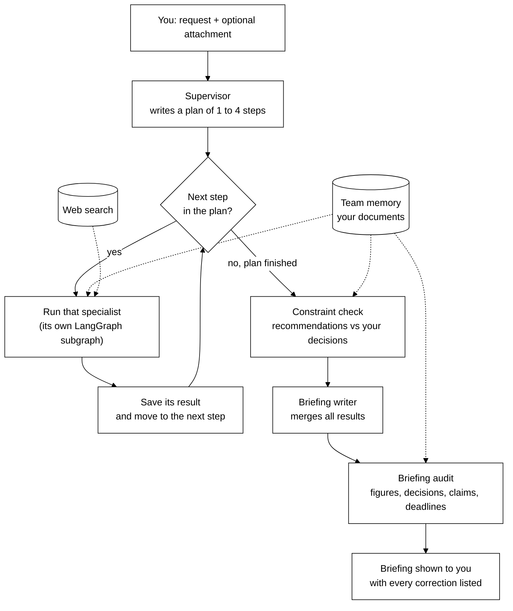
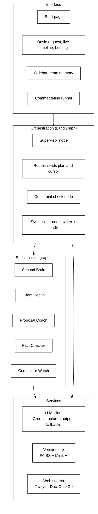
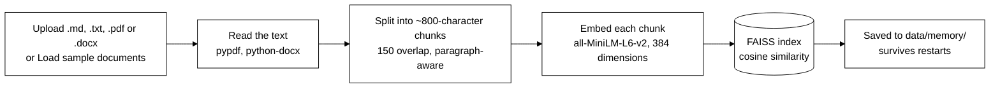
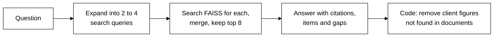
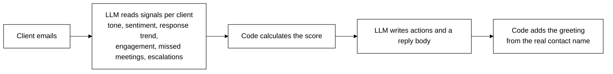
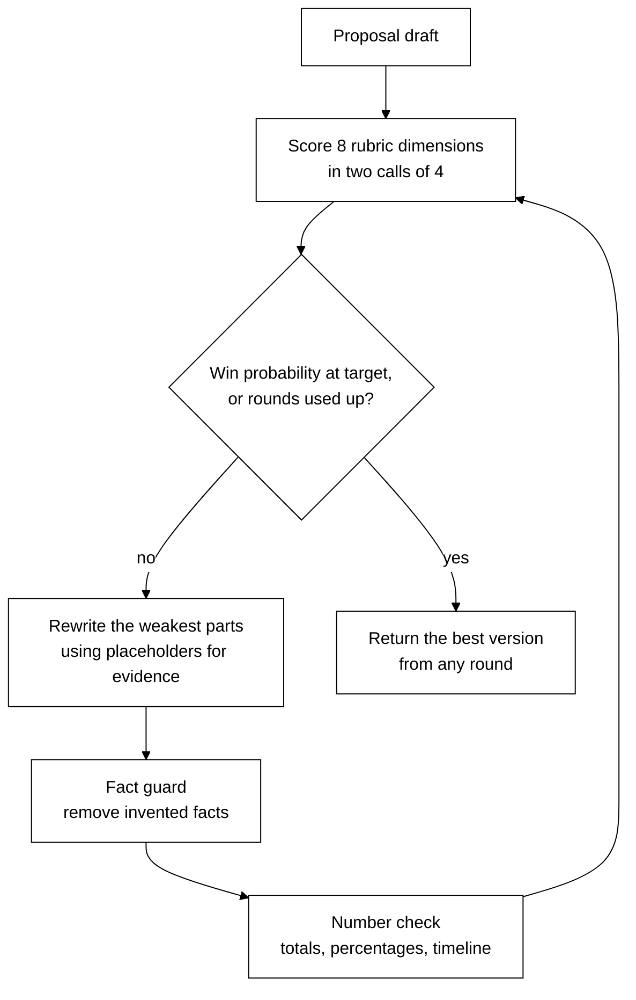
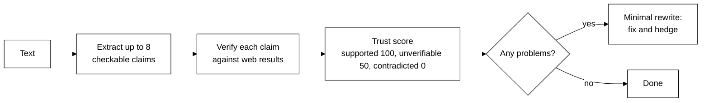
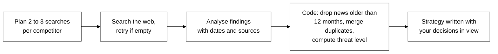

# ConsultAgent-LLM

**Multi-Agent Consulting Copilot: the AI writes, code verifies.**

Ask one question in plain English. A supervisor agent plans the work, hands it to the right specialists, passes their outputs between them, and returns a single executive briefing. Before you read anything, the briefing is checked against your firm's own documents and decisions.

    

---

## Contents

1. [Why this project exists](#1-why-this-project-exists)
2. [What it does](#2-what-it-does)
3. [Quick start](#3-quick-start)
4. [How a request flows](#4-how-a-request-flows)
5. [System architecture](#5-system-architecture)
6. [The agents](#6-the-agents)
7. [Verification layers](#7-verification-layers)
8. [Reliability](#8-reliability)
9. [Using the app](#9-using-the-app)
10. [Test questions with known answers](#10-test-questions-with-known-answers)
11. [Project structure](#11-project-structure)
12. [Configuration](#12-configuration)
13. [Tech stack](#13-tech-stack)
14. [Design decisions and lessons learned](#14-design-decisions-and-lessons-learned)
15. [Known limitations](#15-known-limitations)
16. [Related project: SecuRAG-LLM](#16-related-project-securag-llm)
17. [Roadmap](#17-roadmap)

---

## 1. Why this project exists

Large language models are good at reading, summarising and writing. They are also confidently wrong: they invent client names, give generous scores, add numbers that exist nowhere, and misread rules. In consulting, one invented figure in a client email or proposal can cost a deal.

ConsultAgent-LLM is built on one principle:

> **The LLM does the judgement and the writing. Deterministic code checks the facts.**

Anything that must be *true* (scores, names, figures, dates, totals, and whether a recommendation follows the firm's own rules) is either computed by code or verified by code, never simply trusted to the model.

---

## 2. What it does

Five specialist agents, coordinated by a supervisor:

| Specialist | You give it | You get back |
|---|---|---|
| **Second Brain** | A question about your documents | A grounded answer with citations, owners, dates and overdue items |
| **Client Health** | Client emails or interaction notes | A 0–100 health score per client, churn risk, hidden concerns, next actions and a reply draft |
| **Proposal Coach** | A proposal draft | A rubric score, a win-probability estimate, and an improved version with invented claims removed |
| **Fact Checker** | Any text, often AI-written | A verdict per claim with sources, a trust score and corrected text |
| **Competitor Watch** | Competitor names | Dated, sourced findings, threat levels, and moves that respect your firm's decisions |

The supervisor chooses which specialists run, in what order, and whether one works on another's output. Example:

> *"Improve this proposal, then fact-check the improved version."*
> → Supervisor → Proposal Coach → Fact Checker → Briefing

---

## 3. Quick start

**You need:** Python 3.10+ and a free Groq API key from [console.groq.com/keys](https://console.groq.com/keys).

```bash
git clone https://github.com/manav-17/ConsultAgent-LLM.git
cd ConsultAgent-LLM

python3 -m venv venv
source venv/bin/activate            # Windows: venv\Scripts\activate
pip install -r requirements.txt

cp .env.example .env                # then put your GROQ_API_KEY in .env
python -m streamlit run app/streamlit_app.py
```

Open `http://localhost:8501`, click **Try with sample documents**, then pick an example and click **Run agents**.

> **macOS with Anaconda:** run `conda deactivate` before activating the venv, and always start the app with `python -m streamlit` so it uses the venv's Python.
>
> **After editing code:** restart Streamlit (`Ctrl + C`, then run it again). The file watcher is disabled because it conflicts with PyTorch.

---

## 4. How a request flows

### End-to-end flow



### The four stages

| Stage | What happens | Who does it |
|---|---|---|
| **1. Plan** | The supervisor reads the request and writes a plan: which specialists, in what order, and whether to chain them | LLM (one call) |
| **2. Work** | Each specialist runs its own multi-step workflow and saves its result | LLM + code |
| **3. Check** | Recommendations are checked against your decisions; figures against your documents | LLM + code |
| **4. Brief** | One briefing is written, then audited, and every correction is shown | LLM + code |

The desk shows each stage **live** in a timeline as it runs.

---

## 5. System architecture

### Layers



### Graph design: a supervisor whose nodes are subgraphs

```
                ┌──────────────┐
   START ─────► │  Supervisor  │   one LLM call writes the whole plan
                └──────┬───────┘
                       │  router reads plan[cursor]
     ┌──────────┬──────┼───────────┬─────────────┐
     ▼          ▼      ▼           ▼             ▼
  Second     Client  Proposal    Fact       Competitor     each one is a
  Brain      Health   Coach     Checker       Watch        compiled subgraph
     └──────────┴──────┼───────────┴─────────────┘
                       │  back to the router until the plan is done
                       ▼
                ┌──────────────┐
                │  Constraint  │   recommendations vs your decisions
                │    check     │
                └──────┬───────┘
                       ▼
                ┌──────────────┐
                │ Synthesizer  │   briefing writer, then briefing audit
                └──────┬───────┘
                       ▼
                      END
```

**Why plan-then-execute?** The supervisor plans once and the graph runs the plan step by step. That means fewer LLM calls, no routing loops, a predictable cost, and a plan you can see in the UI.

### Shared state

Every node reads and writes one `AgentState` (defined in `core/state.py`):

| Field | What it holds |
|---|---|
| `request`, `attachment` | What you asked and what you pasted |
| `forced_agent` | Set when you pick a specialist instead of the supervisor |
| `plan` | The steps: `{agent, task, use_previous_output}` |
| `cursor` | Which step runs next |
| `results` | Each specialist's output, by name |
| `trace` | Timeline events shown live in the UI |
| `final_report` | The audited briefing |

### Chaining and failure isolation

- **Chaining:** a plan step with `use_previous_output: true` works on the text from the step before it. Second Brain also receives the previous specialist's output as context, but may only state facts about your firm that come from your documents.
- **Isolation:** each specialist runs inside a wrapper. If one fails, it is marked *failed* in the timeline, the rest of the plan still runs, and the briefing says what is missing.

### How documents enter team memory



---

## 6. The agents

### Supervisor

- One structured call returns a plan of up to 4 steps, each specialist at most once.
- Knows that documents in memory belong to **your own firm**, so tasks are written from your point of view.
- You can bypass it by choosing a specialist under *"Who should handle it?"*.

### Second Brain: multi-query RAG



- Answers cite passages as `[S1]`, `[S2]`, and list what the documents **don't** cover.
- Never infers rules or exceptions the documents don't state, and labels drafts as drafts.

### Client Health



**The score is computed by code**, so every point can be explained:

| Signal | Effect on score |
|---|---|
| Starting point | 70 |
| Sentiment (−100 to +100) | ±20 |
| Response time | faster +5, stable 0, slower −15, much slower −30 |
| Engagement | high +5, medium 0, low −15, disengaged −30 |
| Missed meetings | −8 each, up to −24 |
| Escalations | −10 each, up to −30 |

The final score is kept between 5 and 100. **70+ healthy, 45–69 watch, below 45 critical.**

The model may not claim work is done or attached unless the emails say so, and it never names the recipient. Code does that.

### Proposal Coach: a reflection loop with guards



| Rubric dimension | Weight |
|---|---|
| Problem understanding | 0.15 |
| Value and ROI | 0.20 |
| Pricing justification | 0.15 |
| Scope and timeline | 0.10 |
| Differentiation | 0.10 |
| Social proof | 0.10 |
| Risk mitigation | 0.10 |
| Clarity and next step | 0.10 |

- **Evidence check:** each score needs a quote from the proposal. Code verifies the quote exists; if not, the score is capped at 2/10.
- **Win probability:** a logistic curve over the weighted total (centre 62, scale 8), kept between 3% and 95%. It is a rubric-based estimate, not a trained predictor, and the UI says so.
- **Fact guard:** the model labels each unsupported claim by category; code removes only factual categories (product names, certifications, experience claims, named clients, testimonials, and client metrics or performance figures that contain numbers). Plans and intentions are kept.
- **Number check (code only):** cost rows must add up to the total from the original draft, payment percentages must total 100%, amounts must equal percentage × price, and the stated delivery time must match the plan.

### Fact Checker



### Competitor Watch



- **Threat level is computed by code** from recent findings only. No recent news means **unknown**, never *low*.
- Older findings are listed separately so nothing is hidden.

---

## 7. Verification layers

### Where each check runs

```mermaid
%%{init: {'theme': 'base', 'themeVariables': {'primaryColor': '#ffffff', 'primaryTextColor': '#000000', 'primaryBorderColor': '#000000', 'secondaryColor': '#ffffff', 'tertiaryColor': '#ffffff', 'clusterBkg': '#ffffff', 'clusterBorder': '#000000', 'lineColor': '#000000', 'edgeLabelBackground': '#ffffff'}}}%%
flowchart LR
    subgraph IN["Inside the specialists"]
        V1["Evidence-based scoring"]
        V2["Fact guard"]
        V3["Number check"]
        V4["Freshness filter"]
        V5["Grounded greetings"]
    end
    subgraph AFTER["After the specialists"]
        V6["Constraint check"]
        V7["Figure grounding"]
    end
    subgraph FINAL["On the final briefing"]
        V8["Decision check"]
        V9["Claim audit"]
        V10["Deadline check"]
    end
    IN --> AFTER --> FINAL
    classDef default fill:#ffffff,stroke:#000000,color:#000000;
    style IN fill:#ffffff,stroke:#000000,color:#000000
    style AFTER fill:#ffffff,stroke:#000000,color:#000000
    style FINAL fill:#ffffff,stroke:#000000,color:#000000
    linkStyle default stroke:#000000
```



### What each check prevents

| # | Check | How | What it prevents |
|---|---|---|---|
| 1 | Identity context | Prompt | Agents treating your own firm as a competitor |
| 2 | Evidence-based scoring | LLM + code | Generous scores with no supporting text |
| 3 | Fact guard | LLM + code | Invented products, certifications, testimonials and metrics |
| 4 | Number check | Code | Totals, percentages and timelines that contradict each other |
| 5 | Freshness filter | Code | Old news inflating threat levels |
| 6 | Grounded greetings | Code | Emails addressed to people who don't exist |
| 7 | Constraint check | LLM + code | Recommendations that break your decisions. The decision must be quoted word for word, and code verifies the quote exists |
| 8 | Figure grounding | Code | Invented results about your clients. A figure counts only if it appears near that client's name in your documents; your proposed prices are allowed |
| 9 | Briefing decision check | LLM + code | Rule-breaking actions added by the final writer |
| 10 | Claim audit | LLM + code | Misrepresented clients, drafts shown as delivered work, invented requirements. Runs in sections, so one failure doesn't skip everything |
| 11 | Deadline check | Code | "Complete by" dates that have already passed |

**When a check can't run** (for example because of a rate limit), the briefing says so instead of looking checked. **When memory is empty,** the briefing warns that nothing could be checked against your decisions.

---

## 8. Reliability

| Problem | How it's handled |
|---|---|
| The model returns badly structured output | Retry, then a plain-JSON fallback validated by Pydantic |
| Per-minute rate limit | Waits as long as the provider asks (up to 90 seconds), up to 3 times |
| Daily rate limit | Stops immediately with a clear message, without wasting retries |
| Large outputs fail on smaller models | Work is split into smaller calls (rubric halves, audit sections) |
| One specialist fails | Isolated; the rest of the plan and the briefing still run |
| A later proposal round fails | The best version so far is kept, with a note |
| Web search returns nothing | Retries with simpler queries, then reports *unknown* |
| Display quirks | `$` is escaped so amounts don't turn into maths; tables get the blank line they need |

---

## 9. Using the app

### Start page

A short introduction with an example run, the five specialists, the four stages and the checks.
- **Start a request** opens the desk.
- **Try with sample documents** loads `samples/Zenith_Consulting_Q3_Review.md` into memory, then opens the desk.

### Desk

1. **Team memory (sidebar):** upload documents and click **Add to memory**, or click **Load sample documents**.
2. **Examples:** six buttons that fill in a request (and an attachment where needed).
3. **Your request:** write what you need.
4. **Attach text:** paste emails, a proposal, or text to fact-check, or attach a file.
5. **Who should handle it?** Leave *Let the supervisor decide*, or pick one specialist to save API calls.
6. **Run agents.**

### Reading the result

| Area | What it shows |
|---|---|
| **How the work was routed** | The supervisor's reasoning and a live timeline with timings |
| **Briefing** | The audited summary, plus *Briefing check* and *Adjusted to fit internal decisions* sections when anything was corrected |
| **Specialist detail** | Each specialist's full output in its own tab: scores, tables, sources, downloads |

### Command line

```bash
python run_cli.py --ingest samples/knowledge_base
python run_cli.py "Which clients are at risk?" --file samples/client_emails.txt
python run_cli.py "Fact-check this" --file samples/ai_generated_text.txt --agent hallucination
```

---

## 10. Test questions with known answers

Load the sample documents first. These have known correct answers, so you can judge each result right or wrong in seconds.

| Ask | Correct answer | What it tests |
|---|---|---|
| Which client commitments are overdue and who owns them? | Halcyon security review (due 1 Sept) and fraud-alert demo (due 15 Sept), both Rohit; Orbitron staff training (due 30 Sept), Sneha | Reading structured data |
| Can we hire an MLOps engineer during the hiring freeze? | Yes. The freeze covers only non-technical roles | Not inventing an "exception" |
| Can we take a Rs 50 lakh fixed-price project? | No. Fixed-price work above Rs 40 lakh stopped on 3 July | Reading a rule's scope |
| What ROI did the Orbitron pilot deliver? | No figure in the documents, only a qualitative quote | Not inventing numbers |
| Has the Lumina Telecom chatbot been delivered? | No. It is a draft proposal | Drafts vs delivered work |
| Is Meridian Foods happy with our work? | Mixed: delivered on time, but planners still prefer Excel | Avoiding over-positive summaries |
| *(Second Brain only)* What did Accenture announce in Q3? | Not in the documents | Admitting what it doesn't know |
| *(attach section 5 of the sample)* Fact-check this. | iPhone 2009 → 2007; Python 1985 → 1991 | Web verification |

---

## 11. Project structure

```
ConsultAgent-LLM/
├── app/
│   └── streamlit_app.py         start page, desk, live timeline, result views
├── agents/
│   ├── supervisor.py            plans and routes the work
│   ├── second_brain.py          multi-query RAG over team memory
│   ├── client_health.py         explainable health scores and grounded replies
│   ├── proposal.py              rubric scoring, rewrite loop, fact guard
│   ├── consistency.py           code-only number checks for proposals
│   ├── hallucination.py         Fact Checker
│   ├── competitive_intel.py     Competitor Watch with freshness filter
│   ├── constraints.py           decision checks and figure grounding
│   ├── synthesizer.py           briefing writer and briefing audit
│   └── common.py                shared helpers and agent chaining
├── core/
│   ├── config.py                all settings
│   ├── llm.py                   Groq client, structured calls, fallbacks, rate limits
│   ├── agents_meta.py           agent names, colours, descriptions, identity note
│   ├── state.py                 shared AgentState
│   └── tools.py                 web search
├── graph/
│   └── workflow.py              the top-level LangGraph and live streaming
├── memory/
│   └── vector_store.py          FAISS store, chunking, file loading
├── samples/
│   ├── Zenith_Consulting_Q3_Review.md   sample internal review (used by the app)
│   ├── client_emails.txt               for Client Health
│   ├── proposal_draft.txt              for Proposal Coach
│   ├── ai_generated_text.txt           for Fact Checker
│   └── knowledge_base/                 extra sample notes for the CLI
├── .streamlit/config.toml       theme
├── run_cli.py                   command-line runner
├── requirements.txt
├── .env.example
└── .gitignore
```

---

## 12. Configuration

### `.env`

| Variable | Default | Notes |
|---|---|---|
| `LLM_PROVIDER` | `groq` | |
| `GROQ_API_KEY` | none | Required |
| `LLM_MODEL` | `openai/gpt-oss-120b` | Use `openai/gpt-oss-20b` if the daily limit is reached |
| `TAVILY_API_KEY` | empty | Optional; DuckDuckGo is used without it |

### `core/config.py`

| Setting | Value | Purpose |
|---|---|---|
| `MAX_PLAN_STEPS` | 4 | Specialists per request |
| `MAX_CLAIMS` | 8 | Claims checked by the Fact Checker |
| `MAX_COMPETITORS` | 4 | Competitors per request |
| `MAX_PROPOSAL_ROUNDS` | 2 | Proposal rewrite rounds |
| `TARGET_WIN_PROB` | 75 | Stop rewriting once reached |
| `PARALLEL_WORKERS` | 2 | Parallel calls; small bursts avoid rate limits |
| `CHUNK_SIZE` / `CHUNK_OVERLAP` | 800 / 150 | Document chunking |

---

## 13. Tech stack

| Layer | Technology |
|---|---|
| Orchestration | LangGraph: StateGraph, compiled subgraphs, conditional edges, streaming |
| LLM | Groq: `openai/gpt-oss-120b` (default), `openai/gpt-oss-20b` (fallback) |
| LLM interface | LangChain (`langchain-groq`) with Pydantic structured output |
| Embeddings | sentence-transformers `all-MiniLM-L6-v2` |
| Vector store | FAISS (`faiss-cpu`), inner product on normalised vectors |
| Web search | Tavily (optional key) or DuckDuckGo (`ddgs`) |
| Documents | pypdf, python-docx, Markdown, plain text |
| Interface | Streamlit with a custom theme; Instrument Sans and Newsreader |

---

## 14. Design decisions and lessons learned

These came from testing the system hard and fixing what broke.

1. **Prompts are not enough.** Telling the model *"don't invent names"* didn't stop it inventing names. Moving the greeting into code did.
2. **LLM judges are generous.** A smaller model wrote *"No case studies"* and still gave 8/10. Requiring a quote that code verifies fixed it.
3. **Over-correction is also a failure.** An early fact guard removed 44 items, including harmless plans, and made proposals worse. Now the model labels claims and code applies a clear policy.
4. **"No data" is not "low risk".** Empty search results are reported as *unknown*.
5. **Verify the final output, not just the parts.** Every specialist once passed its checks, yet the briefing recommended self-hosted models, because one agent mistook the user's own firm for a competitor and the error entered through an unchecked path. The fix was shared identity context **and** a check on the briefing the user actually reads.
6. **Numbers need context.** "30%" existed in the documents (a budget overrun) but not for the client it was attached to. Figures are now checked near the right name.
7. **Fail loudly.** When a check can't run, the user is told, rather than shown output that only looks verified.

---

## 15. Known limitations

- **Some calls need a human.** For example, whether *"use Claude and GPT models through APIs only"* also rules out other API models is ambiguous.
- **Free-tier rate limits.** Many runs in a short time can stop part of the briefing check. The app warns when this happens; run on a fresh quota for full checks.
- **Figure checks compare numbers, not meaning.** They look for numbers near client names; an unusual phrasing or coincidence can slip through.
- **Web search quality varies.** DuckDuckGo sometimes returns little or older results. Competitors then show as *unknown*. Always open a few sources.
- **Win probability is an estimate.** It is calibrated by hand, not trained on real win/loss data.
- **Single user, local memory.** Team memory lives on one machine, with no accounts or permissions.

---

## 16. Related project: SecuRAG-LLM

[SecuRAG-LLM](https://github.com/manav-17/SecuRAG-LLM) is a cybersecurity copilot: FLAN-T5 fine-tuned with LoRA and aligned with DPO, with FAISS retrieval over MITRE ATT&CK, CISA KEV and NVD data.

| | SecuRAG-LLM | ConsultAgent-LLM |
|---|---|---|
| Focus | **Training** a model | **Building systems** around LLMs |
| Techniques | Fine-tuning, LoRA, DPO, RAG | Multi-agent orchestration, verification, RAG |
| Shared | FAISS + MiniLM retrieval | The same retrieval design powers Second Brain |

---

## 17. Roadmap

- **Security Advisor agent** powered by SecuRAG-LLM, connecting the two projects (for example, drafting bank security reviews)
- A FastAPI backend so other tools (Slack, n8n, other apps) can call the agents
- Calibrate win probability on real proposal outcomes
- Connectors for email and document drives instead of copy and paste
- Multi-user memory with permissions
- An automated evaluation suite built from the known-answer questions above

---

*All companies, people and figures in `samples/` are fictional.*