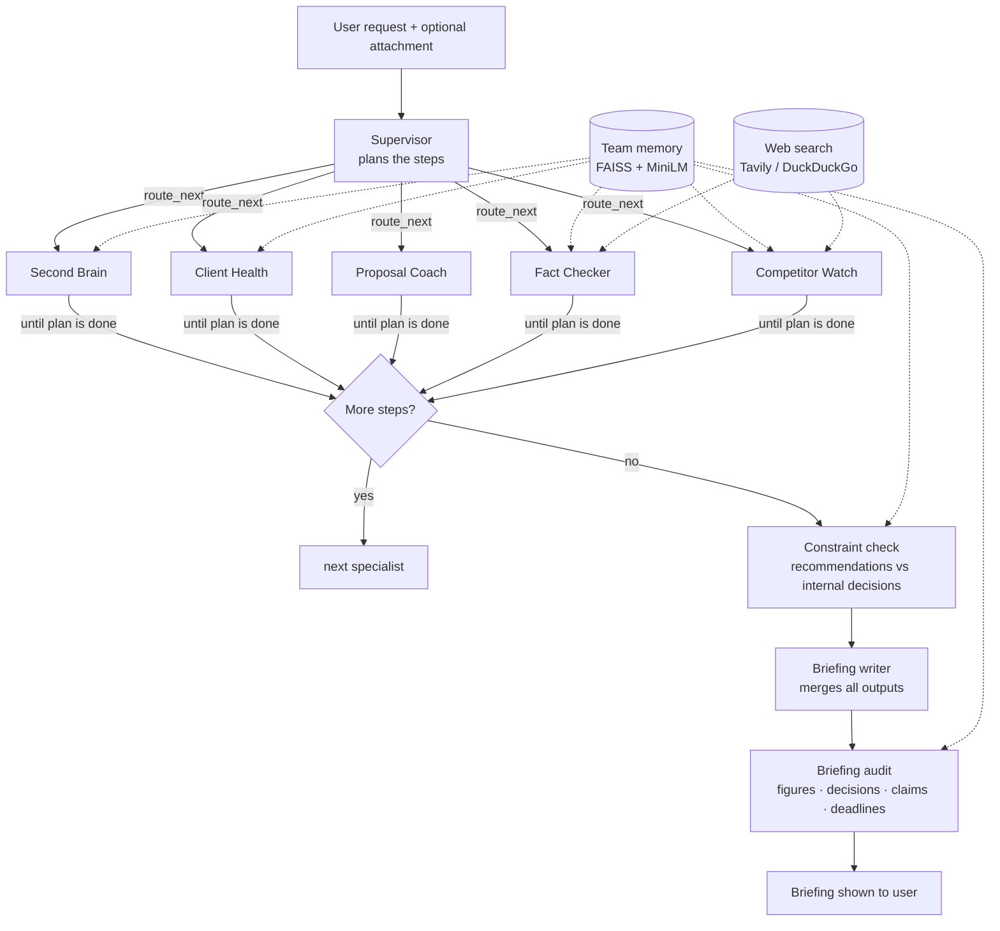

# ConsultAgent-LLM

**Multi-Agent Consulting Copilot: the AI writes, code verifies.**

You ask one question in plain English. A supervisor agent plans the work, routes it to the right specialists, chains their outputs together, and returns a single executive briefing. Before you see anything, the output is checked against your firm's own documents and decisions.

    

---

## Table of contents

1. [Why this project](#why-this-project)
2. [What it does](#what-it-does)
3. [System architecture](#system-architecture)
4. [The agents in detail](#the-agents-in-detail)
5. [Verification layers](#verification-layers)
6. [Reliability engineering](#reliability-engineering)
7. [Tech stack](#tech-stack)
8. [Project structure](#project-structure)
9. [Setup](#setup)
10. [Using ConsultAgent-LLM](#using-consultagent-llm)
11. [Test questions with known answers](#test-questions-with-known-answers)
12. [Configuration](#configuration)
13. [Design decisions and lessons learned](#design-decisions-and-lessons-learned)
14. [Known limitations](#known-limitations)
15. [Related project: SecuRAG-LLM](#related-project-securag-llm)
16. [Roadmap](#roadmap)

---

## Why this project

LLMs are good at reading, summarising and writing. They are also confidently wrong: they invent client names, inflate scores, add figures that exist nowhere, and misread rules. In a consulting firm, one invented number in a client email or proposal can cost a deal.

ConsultAgent-LLM explores a simple principle for building trustworthy AI systems:

> **The LLM does the judgement and the writing. Deterministic code verifies the facts.**

Every agent is built so that the parts that must be *true* (scores, names, figures, dates, totals, compliance with internal rules) are checked or computed by code, not trusted to the model.

---

## What it does

| Specialist | Input | Output |
|---|---|---|
| **Second Brain** | Questions about your own documents | Grounded answers with citations, decisions, commitments and overdue items |
| **Client Health** | Client emails or interaction logs | Health score 0–100 per client, churn risk, hidden concerns, actions and a reply draft |
| **Proposal Coach** | A proposal draft | Rubric score, win-probability estimate, an improved rewrite with fabrications removed |
| **Fact Checker** | Any text (often AI-generated) | Verdict per claim with sources, a trust score and corrected text |
| **Competitor Watch** | Competitor names | Dated, sourced findings, threat levels, and moves that respect your decisions |

A **supervisor** decides which specialists to run, in what order, and whether one should work on another's output. For example:

> *"Improve this proposal, then fact-check the improved version"* → Supervisor → Proposal Coach → Fact Checker → Briefing

---

## System architecture

### High-level flow



### Hierarchical multi-agent design

ConsultAgent-LLM is a **supervisor graph whose nodes are themselves LangGraph subgraphs**:

```
                ┌──────────────┐
    START ────► │  supervisor  │   one LLM call writes the whole plan
                └──────┬───────┘
                       │ route_next() reads plan[cursor]
     ┌──────────┬──────┼───────────┬─────────────┐
     ▼          ▼      ▼           ▼             ▼
 second_brain  fact  client   competitor     proposal      ← each a compiled subgraph
     │       checker health      watch          │
     └──────────┴──────┼───────────┴─────────────┘
                       ▼ (loops back to route_next until the plan is done)
                ┌──────────────┐
                │constraint chk│   recommendations vs the firm's own decisions
                └──────┬───────┘
                ┌──────▼───────┐
                │ synthesizer  │   briefing writer + briefing audit
                └──────┬───────┘
                       ▼
                      END
```

**Why plan-and-execute instead of a looping supervisor?** The supervisor makes one planning call and the graph executes the plan deterministically. That means fewer LLM calls, no routing loops, a predictable cost, and a plan the user can see.

### Shared state

All nodes read and write one `AgentState`:

| Field | Purpose |
|---|---|
| `request`, `attachment` | What the user asked and pasted |
| `plan` | Steps: `{agent, task, use_previous_output}` |
| `cursor` | Index of the next step |
| `results` | Each agent's output, keyed by agent name |
| `trace` | Timeline events shown live in the UI |
| `final_report` | The audited briefing |

### Agent chaining

When a plan step has `use_previous_output: true`, that agent works on the text produced by the step before it. Second Brain also receives the previous specialist's output as context (for example, Competitor Watch findings), but may only state facts about the firm that come from the stored documents.

### Failure isolation

Each agent runs inside a wrapper. If one agent fails, its result is marked `error`, the timeline shows *failed*, and the remaining agents and the briefing still run. The briefing states what is missing.

---

## The agents in detail

### Supervisor
- One structured LLM call returns a plan of up to 4 steps (each specialist at most once).
- Told that documents in memory are **the user's own firm's** documents, so tasks are written from the user's point of view.
- Can be bypassed in the UI by choosing a specialist under *"Who should handle it?"*.

### Second Brain — multi-query RAG
```
expand_query ─► retrieve ─► answer
```
- **expand_query:** rewrites the question into 2–4 search queries and picks a mode (question, commitments, decisions or timeline).
- **retrieve:** searches FAISS for every query, merges and de-duplicates, and keeps the top 8 passages.
- **answer:** a grounded answer citing `[S1]`, `[S2]`…, structured items (owner, date, status) and an explicit list of what the documents **don't** cover.
- Code then removes any figure about your own clients that does not appear near that client in your documents.

**Vector store:** `all-MiniLM-L6-v2` embeddings (384-dim), FAISS `IndexFlatIP` on normalised vectors (cosine similarity), paragraph-aware chunks of ~800 characters with 150 overlap, persisted to `data/memory/`.

### Client Health
```
read_signals ─► score_and_rank ─► recommend
```
- The LLM extracts observable signals per client: contact name, tone, sentiment, response-time trend, engagement, missed meetings, escalations, hidden concerns, and evidence quotes.
- **The score is calculated by code**, not the model, so every point can be explained:

| Signal | Effect |
|---|---|
| Baseline | 70 |
| Sentiment (−100 to +100) | ±20 |
| Response time | faster +5 · stable 0 · slower −15 · much slower −30 |
| Engagement | high +5 · medium 0 · low −15 · disengaged −30 |
| Missed meetings | −8 each (max −24) |
| Escalations | −10 each (max −30) |

Final score is clamped to **5–100**. Bands: **≥70 healthy · 45–69 watch · <45 critical**.

- **Reply drafts:** the model writes only the body. **Code adds the greeting** from the extracted contact name, plus the sign-off, so the model can never invent a recipient. The model may not claim work is done or attached unless the evidence says so.

### Proposal Coach — reflection loop with guards
```
score ─► (good enough or rounds used?) ─► END
  ▲            │ no
  └── consistency ◄── ground ◄── rewrite
```
- **Score:** 8 weighted rubric dimensions, scored in **two calls of 4** (smaller outputs are more reliable):

| Dimension | Weight |
|---|---|
| Problem understanding | 0.15 |
| Value & ROI | 0.20 |
| Pricing justification | 0.15 |
| Scope & timeline | 0.10 |
| Differentiation | 0.10 |
| Social proof | 0.10 |
| Risk mitigation | 0.10 |
| Clarity & next step | 0.10 |

- **Evidence check:** each score must come with a quote from the proposal; code verifies the quote exists. Missing or invented quote → the score is capped at **2/10**.
- **Win probability** = logistic curve of the weighted total (centre 62, scale 8), clipped to 3–95%. It is a rubric-based estimate, not a trained predictor, and the UI says so.
- **Rewrite:** fixes the weakest dimensions using `[Add: …]` placeholders instead of invented evidence.
- **Fact guard:** a second call lists unsupported claims with a category; **code redacts only factual categories** (product names, certifications, experience claims, named clients, testimonials, client metrics and performance figures with numbers). Plans and intentions are kept.
- **Number check (pure code):** cost rows must add up to the total (pinned to the draft's price), payment percentages must total 100%, amounts must equal % × price, and the stated delivery time must match the plan's phases.
- Up to 2 rewrite rounds; the **best-scoring version from any round** is returned.

### Fact Checker
```
extract_claims ─► verify_claims ─► score ─► (issues?) ─► rewrite
```
- Extracts up to 8 checkable claims and verifies each against web results (and internal documents when relevant).
- Verdicts: supported (100%) · unverifiable (50%) · contradicted (0%), averaged into a trust score.
- Rewrites minimally: fixes contradicted claims and hedges unverifiable ones.

### Competitor Watch
```
plan_research ─► gather ─► analyse ─► strategise
```
- Plans 2–3 searches per competitor (up to 4 competitors) across launches, hiring, pricing, partnerships and funding.
- **Retries** with simpler queries if search returns nothing.
- **Freshness (pure code):** findings older than 12 months are excluded from the threat level and listed separately. **Threat level is computed by code** from recent findings only; no recent news → **"unknown"**, never "low".
- Duplicate articles are merged.
- **Strategy is written with your internal decisions in view** (prevention), then verified by the constraint check.

---

## Verification layers

| # | Layer | Type | What it prevents |
|---|---|---|---|
| 1 | Identity context | Prompt | Agents treating your own firm as a competitor |
| 2 | Evidence-based scoring | LLM + code | Lenient scores with no supporting text |
| 3 | Fact guard | LLM + code | Invented products, certifications, testimonials, metrics |
| 4 | Number check | Code | Totals, percentages and timelines that contradict each other |
| 5 | Freshness filter | Code | Old news inflating threat levels |
| 6 | Constraint check | LLM + code | Recommendations that break your decisions (the decision must be quoted word for word; code verifies the quote exists) |
| 7 | Figure grounding | Code | Invented results about your own clients. A figure is accepted only if it appears **near that client's name** in your documents; your proposed prices are allowed |
| 8 | Briefing decision check | LLM + code | Rule-breaking actions added by the final writer |
| 9 | Claim audit | LLM + code | Misrepresented clients, drafts presented as delivered work, invented requirements. Runs in sections so one failure doesn't skip everything |
| 10 | Deadline check | Code | "Complete by" dates that have already passed |

When a check cannot run (for example because of a rate limit), the briefing says so instead of looking checked.

---

## Reliability engineering

| Problem | Handling |
|---|---|
| Model returns malformed structured output | Retry, then a plain-JSON fallback validated with Pydantic |
| Per-minute rate limit (429, short wait) | Waits as long as the provider asks (up to 90 s), up to 3 times |
| Daily rate limit (429, long wait) | Stops immediately and reports clearly, without wasting retries |
| Large outputs fail on smaller models | Work split into smaller calls (rubric halves, audit sections) |
| One agent fails | Isolated; the rest of the plan and the briefing still run |
| A later proposal round fails | The best version so far is kept, with a note |
| Web search returns nothing | Retry with simpler queries, then "unknown" |
| Markdown quirks | `$` escaped (Streamlit treats `$…$` as maths); blank lines added before tables |

---

## Tech stack

| Layer | Technology |
|---|---|
| Orchestration | LangGraph (StateGraph, subgraphs, conditional edges) |
| LLM | Groq — `openai/gpt-oss-120b` (default), `openai/gpt-oss-20b` (fallback) |
| LLM interface | LangChain (`langchain-groq`), structured output with Pydantic |
| Embeddings | sentence-transformers `all-MiniLM-L6-v2` |
| Vector store | FAISS (`faiss-cpu`) |
| Web search | Tavily (optional key) or DuckDuckGo (`ddgs`) |
| Documents | pypdf, python-docx, Markdown, text |
| UI | Streamlit, custom theme, live relay timeline |

---

## Project structure

```
ConsultAgent-LLM/
├── app/
│   └── streamlit_app.py        UI: scenarios, memory panel, live timeline, result renderers
├── agents/
│   ├── supervisor.py           plans and routes work
│   ├── second_brain.py         multi-query RAG over team memory
│   ├── client_health.py        explainable health scores, grounded replies
│   ├── proposal.py             rubric scoring, rewrite loop, fact guard
│   ├── consistency.py          pure-code number checks for proposals
│   ├── hallucination.py        Fact Checker
│   ├── competitive_intel.py    Competitor Watch with freshness filter
│   ├── constraints.py          decision checks and figure grounding
│   ├── synthesizer.py          briefing writer and briefing audit
│   └── common.py               shared helpers and agent chaining
├── core/
│   ├── config.py               all settings
│   ├── llm.py                  Groq client, structured calls, fallbacks, rate-limit handling
│   ├── agents_meta.py          agent names, colours, descriptions, identity note
│   ├── state.py                shared graph state
│   └── tools.py                web search
├── graph/
│   └── workflow.py             top-level LangGraph and streaming
├── memory/
│   └── vector_store.py         FAISS store, chunking, file loading
├── samples/                    fictional test documents
├── .streamlit/config.toml      theme
├── run_cli.py                  command-line runner
├── requirements.txt
├── .env.example
└── .gitignore
```

---

## Setup

**Requirements:** Python 3.10+ and a free Groq API key from [console.groq.com/keys](https://console.groq.com/keys).

```bash
git clone https://github.com/manav-17/ConsultAgent-LLM.git
cd ConsultAgent-LLM

python3 -m venv venv
source venv/bin/activate          # Windows: venv\Scripts\activate
pip install -r requirements.txt

cp .env.example .env              # then add your GROQ_API_KEY
python -m streamlit run app/streamlit_app.py
```

The app opens at `http://localhost:8501`.

**macOS with Anaconda:** run `conda deactivate` before activating the venv, and start Streamlit with `python -m streamlit` so it uses the venv's Python.

Streamlit's file watcher is disabled (it conflicts with PyTorch), so **restart Streamlit after editing any `.py` file**.

---

## Using ConsultAgent-LLM

1. **Load your documents:** sidebar → upload `.md`, `.txt`, `.pdf` or `.docx` → **Add to memory**. Try `samples/Zenith_Consulting_Q3_Review.md`.
2. **Ask** in *"What do you need?"*. Paste emails, a proposal or text to check into *"Attach text"* when needed.
3. **Routing:** leave *"Let the supervisor decide"*, or pick a specialist to save API calls.
4. **Read the result:**
   - **How the work was routed:** the supervisor's reasoning and a live timeline with timings
   - **Briefing:** the audited summary, plus *"Briefing check"* and *"Adjusted to fit internal decisions"* sections when anything was corrected
   - **Specialist detail:** each agent's full output in its own tab

**Without documents in memory**, recommendations can't be checked against your decisions, and the briefing says so.

### Command line

```bash
python run_cli.py --ingest samples/knowledge_base
python run_cli.py "Which clients are at risk?" --file samples/client_emails.txt
python run_cli.py "Fact-check this" --file samples/ai_generated_text.txt --agent hallucination
```

---

## Test questions with known answers

Load `samples/Zenith_Consulting_Q3_Review.md` first. These have known correct answers, so you can judge the system right or wrong in seconds.

| Question | Correct answer | What it tests |
|---|---|---|
| Which client commitments are overdue and who owns them? | Halcyon security review (1 Sept) and fraud demo (15 Sept), both Rohit; Orbitron training (30 Sept), Sneha | Reading structured data |
| Can we hire an MLOps engineer during the hiring freeze? | Yes — the freeze covers only non-technical roles | Not inventing an "exception" |
| What ROI did the Orbitron pilot deliver? | No figure in the documents, only a qualitative quote | Not inventing numbers |
| Has the Lumina chatbot been delivered? | No — it is a draft proposal | Drafts vs delivered work |
| Is Meridian Foods happy with our work? | Mixed: on-time delivery, but planners prefer Excel | Over-positive summaries |
| *(Second Brain only)* What did Accenture announce in Q3? | Not in the documents | Admitting what it doesn't know |
| *(attach section 5)* Fact-check this. | iPhone 2009 → 2007, Python 1985 → 1991 | Web verification |

---

## Configuration

`.env`:

| Variable | Default | Notes |
|---|---|---|
| `LLM_PROVIDER` | `groq` | |
| `GROQ_API_KEY` | — | Required |
| `LLM_MODEL` | `openai/gpt-oss-120b` | Use `openai/gpt-oss-20b` if the daily limit is reached |
| `TAVILY_API_KEY` | empty | Optional; DuckDuckGo is used without it |

`core/config.py`:

| Setting | Value | Purpose |
|---|---|---|
| `MAX_PLAN_STEPS` | 4 | Specialists per request |
| `MAX_CLAIMS` | 8 | Claims checked by the Fact Checker |
| `MAX_COMPETITORS` | 4 | Competitors per request |
| `MAX_PROPOSAL_ROUNDS` | 2 | Rewrite rounds |
| `TARGET_WIN_PROB` | 75 | Stop rewriting once reached |
| `PARALLEL_WORKERS` | 2 | Parallel calls (small bursts avoid rate limits) |
| `CHUNK_SIZE` / `CHUNK_OVERLAP` | 800 / 150 | Document chunking |

---

## Design decisions and lessons learned

These came from testing the system hard and fixing what broke.

1. **Prompts are not enough.** Telling the model *"don't invent names"* did not stop it inventing names. Moving the greeting into code did.
2. **LLM judges are lenient.** A smaller model wrote *"No case studies"* and still scored 8/10. Requiring a quote that code verifies fixed it.
3. **Over-correction is a failure too.** An early fact guard removed 44 items, including harmless plans, and the proposal got worse. The model now *classifies* claims and code applies a clear policy.
4. **"No data" is not "low risk".** Empty search results became *unknown*, never *low threat*.
5. **Verify the final output, not just the parts.** Every agent passed its checks, yet the final briefing once recommended self-hosted models, because one agent mistook the user's own firm for a competitor and the error entered through an unchecked path. The fix was shared identity context **and** a check on the briefing the user actually reads.
6. **Context matters for numbers.** "30%" existed in the documents (a budget overrun) but not for the client it was attached to. Figures are now checked near the right name.
7. **Fail loudly.** When a check cannot run, the user is told, rather than shown output that only looks verified.

---

## Known limitations

- **Judgement calls stay with humans.** For example, whether *"use Claude and GPT models through APIs only"* also rules out other API models (Mistral, Gemini) is ambiguous. Such cases need a person to decide.
- **Rate limits on the free tier.** Many runs in a short time can make part of the briefing check fail. The app warns when this happens; run on a fresh quota for full checks.
- **Figure checks match numbers, not meaning.** They compare numbers near client names; a coincidental match or an unusual phrasing can slip through.
- **Web search quality varies.** DuckDuckGo sometimes returns little or older results. Competitors then show as *unknown*. Always click a few source links.
- **Win probability is an estimate.** It is calibrated by hand, not trained on real win/loss data.
- **Single user, local memory.** Team memory is stored on one machine; there are no user accounts or permissions.

---

## Related project: SecuRAG-LLM

[SecuRAG-LLM](https://github.com/manav-17/SecuRAG-LLM) is a cybersecurity question-answering system: FLAN-T5 fine-tuned with LoRA and aligned with DPO (RLHF), with FAISS retrieval over MITRE ATT&CK, CISA KEV and NVD data.

| | SecuRAG-LLM | ConsultAgent-LLM |
|---|---|---|
| Focus | **Training** a model | **Building systems** around LLMs |
| Techniques | Fine-tuning, LoRA, DPO, RAG | Multi-agent orchestration, verification, RAG |
| Shared | FAISS + MiniLM retrieval | The same retrieval design in Second Brain |

---

## Roadmap

- **Security Advisor agent** powered by SecuRAG-LLM, connecting the two projects (e.g. drafting bank security reviews)
- Calibrate win probability on real proposal outcomes
- Connectors for email, Slack and document drives instead of copy-paste
- Multi-user memory with permissions
- Scheduled runs (e.g. a weekly competitor digest)
- An automated evaluation suite built from the known-answer questions above

---

*All companies, people and figures in `samples/` are fictional.*